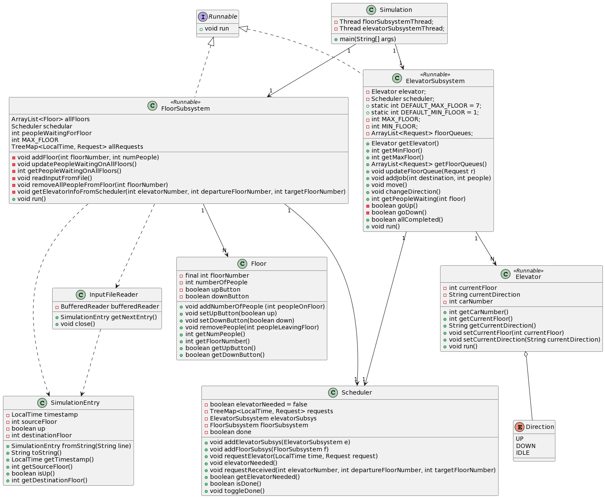

# SYSC3303A2 - L2 GROUP 2 : ELEVATOR CONTROL SYSTEM & SIMULATOR

* Subear Jama - 101154626
* Jacob Hovey - 101163798
* William Forrest - 100803271
* Farhan Mahamud - 101147861

## Overview
Our program is composed of four major components; the floor subsystem and the elevator subsystem are the threads, and 
the scheduler is the lock for the threads. Our fourth component, what we have called the simulator, is the 
entry point to run the program. For this iteration, all the simulator does is contain our main function. 

To run the program, you must run Simulation.java in the simulator package. This should then automatically 
input an example text file that we have created with elevator request data, and will print the results 
showing that the data was passed back and forth between the subsystems, through the scheduler.

In our test folder, we have created tests for the floor subsystem, file reader and elevator subsystem. We
believe that these tests are enough to fully encompass the functionality of our program for iteration 1. 
An important thing to note is that we have used Mockito in some of our tests. It is a mocking framework that 
helped us to write clean and simple tests. This should not present any issue when running our program or tests, but
 we believe it is important to note that this library has been used in case there are any discrepancies.

All of the tests are included in the floor and elevator test packages, in FloorSubsystemTest.java, 
InputFileReaderTest.java, and ElevatorSubsystemTest.java. Each of these suites can be run from their respective files.

## Main Filenames (Explained)
Below are the files within src that make up the Elevator Control System.
All the diagrams (UML Class Diagram and UML Sequence Diagrams) are located in the "diagrams" folder.

1. elevator (package)
   * ElevatorSubsystem.java : used to communicate with the Scheduler to manage the elevator. Implements runnable to be a thread.
   * Elevator.java : used within ElevatorSubsystem to represent the state of the elevator. Implements runnable to be a thread.
2. floor (package)
   * FloorSubsystem.java : reads input text file and sets up Floors to communicate with the Scheduler. Implements runnable to be a thread.
   * Floor.java : used in FloorSubsystem to set up a floor in a building.
   * InputFileReader.java : used within FloorSubsystem to help read a text file.
   * SimulationEntry.java : used within FloorSubsystem to help read a text file.
3. scheduler (package)
   * Scheduler.java : responsible for communication between FloorSubsystem and ElevatorSubsystem. keeps everything thread-safe (Mutual Exclusion and Condition Synchronization)
   * Request.java : used to save all relevant request information to use for optimizing scheduling.
4. simulator (package) 
   * Simulation.java : responsible for program initialization & running the simulation from the console

## Set Up Instructions (Using Eclipse)
Below are the set up instructions. For more information, see "L2G2_Test_Instructions.pdf".

### How to run
1. Extract the zip file
2. In Eclipse go to File > Import
3. Click the general folder and underneath select "Existing Projects into Workspace" and then click next
4. Check "Select root directory" and click browse to select the folder "iteration1". Click Finish
5. In the "simulator" package you will find "Simulation.java" to run and see the simulation in the console!

### Another way to run:
1. Extract the zip file
2. Open Eclipse and click File > New > Java Project
3. Use file location folder where the zip was extracted to (Uncheck "Use Default Location")
4. Click Finish
5. Run Simulation.java to see the simulation run in the console!

### Running tests (Using JUnit)
1. Right click the "tests" folder in the project explorer
2. Select "run as JUnit tests"

## Breakdown Of Responsibilities
For more information on how everything was split equally, see "L2G2_Teamwork_Breakdown.pdf".

### Iteration 1
- Subear Jama - FloorSubsystem + Floor + FloorSubsystemTest + Readme + InputFileReader
- Jacob Hovey - Scheduler + Request + Setup & test instructions + Breakdown of responsibilities
- William Forrest - Simulation + Testing + UML Class Diagram + InputFileReader & SimulationEntry
- Farhan Mahamud - ElevatorSubsystem + Elevator + UML Sequence Diagrams

