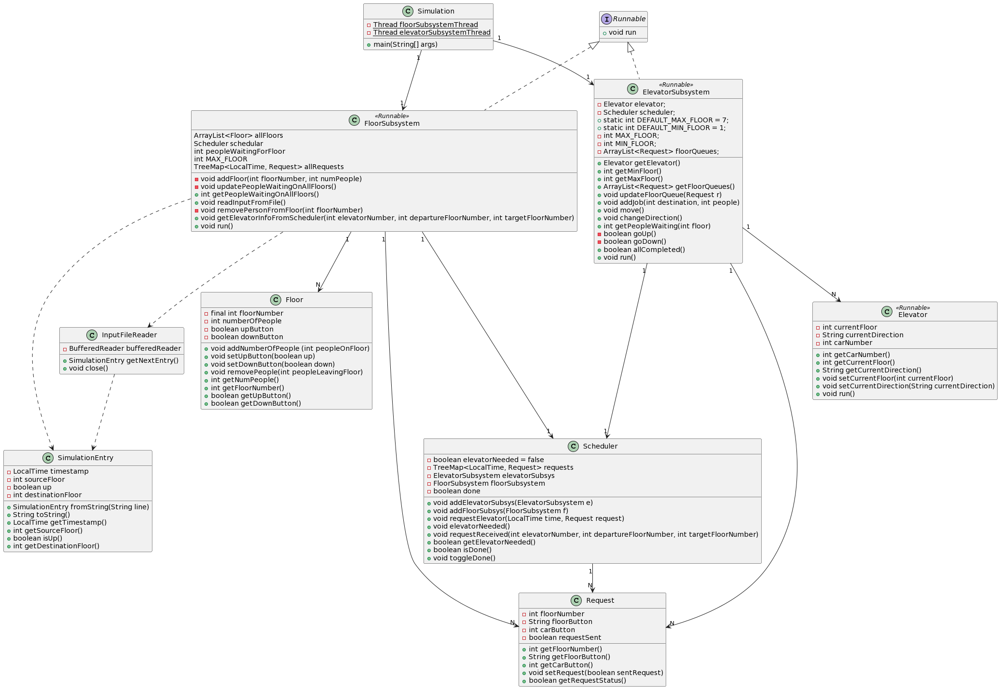
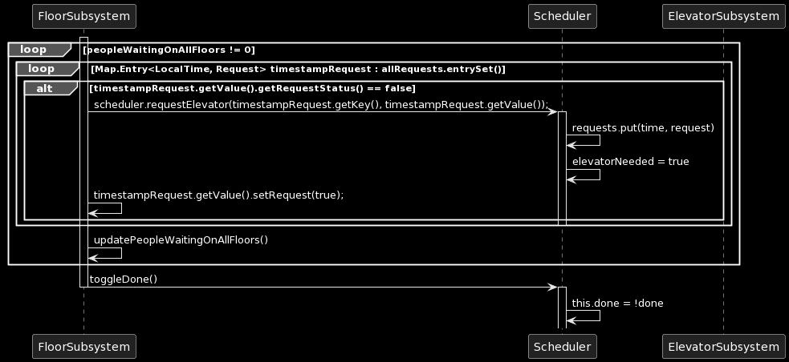
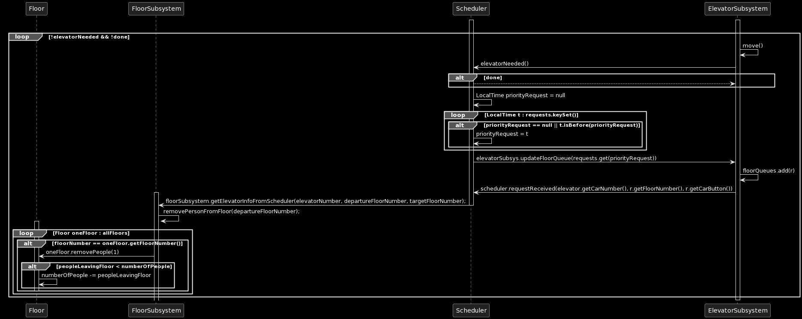

## Elevator System

#### System overview

The elevator system is divided at this stage is divided into two main threads, the floor subsystem and the elevator subsystem. Both share a scheduler that determines where and when elevators should move.

