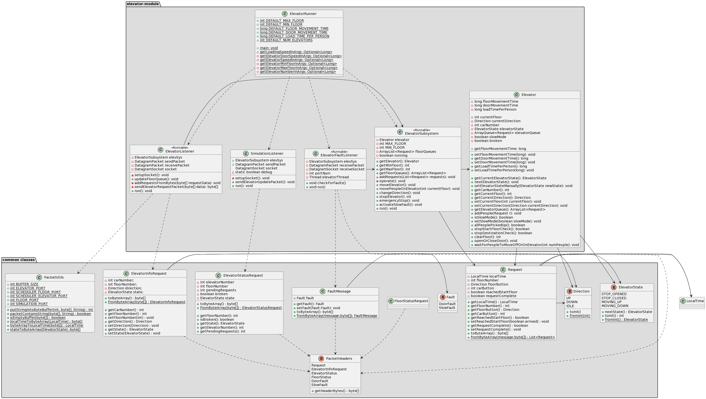
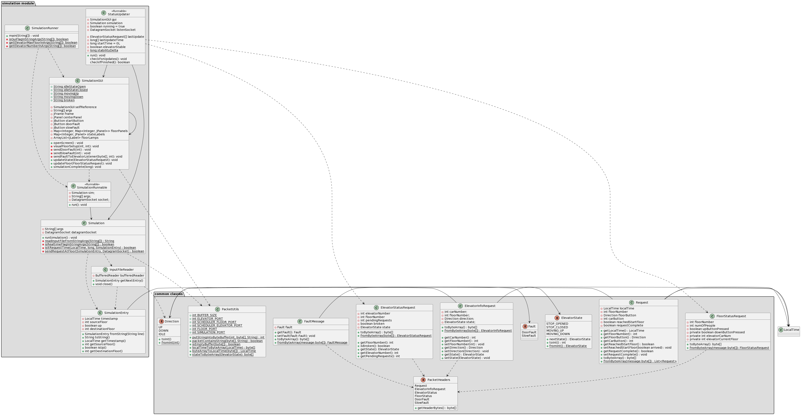

# SYSC3303A2 - L2 GROUP 2 : ELEVATOR CONTROL SYSTEM & SIMULATOR

* Subear Jama - 101154626
* Jacob Hovey - 101163798
* William Forrest - 100803271
* Farhan Mahamud - 101147861

## Overview
Our program is composed of four major components; the floor subsystem and the elevator subsystem are the threads, and 
the scheduler is the lock for the threads. Our fourth component, what we have called the simulator, is the 
entry point to run the program. For this iteration, all the simulator does is contain our main function. 

To run the program, you must run each of the floors, and scheduler modules, and then run the SimulationRunner the simulator module, followed by the elevator module.
This then will automatically input an example text file (in the simulation module) that we have created with elevator request data, and will print the results 
showing that the data was passed back and forth between the subsystems, and the scheduler modules.

In our test folders, we have created tests for the floor subsystem, file reader and elevator subsystem. We
believe that these tests are enough to fully encompass the functionality of our program for iteration 1. 
An important thing to note is that we have used Mockito in some of our tests. It is a mocking framework that 
helped us to write clean and simple tests. This should not present any issue when running our program or tests, but
 we believe it is important to note that this library has been used in case there are any discrepancies.

All of the tests are included in the same java packages as the source, but under the test folder of their respective maven module:
1. common-classes (module)
   * RequestTest.java
   * ElevatorInfoRequestTest.java
   * FaultMessageTest.java
1. elevator-module (module)
   * ElevatorSubsystemTest.java
   * ElevatorTest.java
   * ElevatorFaultListenerTest.java
2. floor-module (module)
   * FloorSubsystemTest.java
3. scheduler-module (module)
   * SchedulerTest.java
   * FloorHelperTest.java
   * ElevatorHelperTest.java
4. simulation-module (module)
   * SimulationTest.java
   * InputFileReaderTest.java

Each of these suites can be run from their respective files.

## Main Filenames (Explained)
Below are the files within the source folders that make up the Elevator Control System.
All the diagrams (UML Class Diagram and UML Sequence Diagrams) are located in the "diagrams" folder.

# common-classes (module)

* Direction : A shared enum to indicate direction of the elevator
* ElevatorInfoRequest : A class representing an elevator state, sent by the Elevator
* ElevatorState : A shared enum to indicate the state of an elevator
* ElevatorStatusRequest: A shared class to convert an elevator request into a byte array to be used and sent via UDP packets
* Fault : A shared enum to indicate what kind of fault has occured
* FaultMessage: A shared class to convert a Fault message into a byte array and be used to sent via UDP packets
* FloorStatusRequest: A shared class to convert a floor request into a byte array to be used and sent via UDP packets
* PacketHeaders : An enum that helps manage packet headers for reading of network objects
* PacketUtils : A class with helpfule static functions and constants
* Request : A class that is sent from the simulation, representing a request

# elevator (module)

* Elevator.java : a class to represent the elevator hardware 
* ElevatorFaultListener.java : a class that passively waits for fault packets
* ElevatorListener.java: a class that actively (IE poll) the scheduler to communicate with it
* ElevatorRunner.java: a class that runs the main() function for the elevator subsystem with default values
* ElevatorSubsystem.java : a class to manage elevators
* SimulationListener.java : a class for an elevator subsystem to send status updates to the simulation
  
# floor (module)

* FloorSubsystem.java : a class to manage floor operations
* Floor.java : used in FloorSubsystem to set up a floor in a building.
* FloorSimulationListener.java : a class for a floor subsystem to send status updates to the simulation
  
# scheduler-module (module)

* Scheduler.java : responsible for communication between FloorSubsystem and ElevatorSubsystem.
* FloorHelper.java : A helper class for communication with the floors
* ElevatorHelper.java : A helper class for communication with the elevators

# simulation-module (module) 

* Simulation.java : responsible for program initialization & running the simulation from the console
* SimulationThread.java : A class used to box the simulation in a thread, used in SimulationRunner.java and SimulationGUI.java
* SimulationRunner.java : A class that used to kickoff the Simulation class from the command line.
* SimulationGUI.java : A class used to also kickoff the simulation class, and allows sending of faults
* InputFileReader.java : used within FloorSubsystem to help read a text file.
* SimulationEntry.java : used within FloorSubsystem to help read a text file.
* SimulationGUI.java : A class to display the GUI to control the programs

## Set Up Instructions (Using Eclipse)
Below are the set up instructions. For more information, see "L2G2_Test_Instructions.pdf".

### How to run
1. Extract the zip file
2. In Eclipse go to File > Import
3. Click the general folder and underneath select "Existing Maven Projects" and then click next
4. Check "Select root directory" and click browse to select the folder "iteration2". Click Finish
5. Right click the lab2group2 folder in the "Package Explorer" sidebar.
6. Go to "Maven"
7. Select Update Project...
8. Select the project and click "Ok"
9. Let eclipse download the appropriate dependencies (Such as JUnit)
10. In the "scheduler-module" package run the Scheduler.java (NOTE 1)
11. In the "floor-module" package run the FloorSubsystem.java (NOTE 1)
12. In the "elevator-module" package run the ElevatorSubsystem.java (NOTE 1)
13. In the "simulator" package run "Simulation.java" to send data the to the elevator system!
 * If you'd like to run in realtime mode, add the argument --realtime
 * If you'd like to run a new file for sending requests, use the argument --file [filename] (This can only be used on non-gui mode this iteration)
 * If you'd like to run with  a GUI (allowing sending of faults), use the argument --gui
14. See progress in the console. It is suggested to stop the elevator early to make it easier to read it's logs (It is always active)

### Another way to run:
1. Extract the zip file
2. Open Eclipse and click File > New > Maven Project
3. Use file location folder where the zip was extracted to (Uncheck "Use Default Location")
4. Click Finish
5. Right click the lab2group2 folder in the "Package Explorer" sidebar.
6. Go to "Maven"
7. Select Update Project...
8. Select the project and click "Ok"
9. Let eclipse download the appropriate dependencies (Such as JUnit)
10. In the "scheduler-module" package run the Scheduler.java (NOTE 1) 
11. In the "floor-module" package run the FloorSubsystem.java (NOTE 1)
12. In the "elevator-module" package run the ElevatorSubsystem.java (NOTE 1)
13. In the "simulator" package run "Simulation.java" to send data the to the elevator system!
 * If you'd like to run in realtime mode, add the argument --realtime
 * If you'd like to run a new file for sending requests, use the argument --file [filename] (This can only be used on non-gui mode this iteration)
 * If you'd like to run with  a GUI (allowing sending of faults), use the argument --gui
14. See progress in the console. It is suggested to stop the elevator early to make it easier to read it's logs (It is always active)

* NOTE 1: You can run the programs in any order you want so long as Simulator.java is not run in headless mode

### Running tests (Using JUnit)
1. Right click the "tests" folder in the project explorer from any module
2. Select "run as JUnit tests"

### Running tests (Using maven and JUnit)
1. Right click the lab2group2 folder in the "Package Explorer" sidebar.
2. Go to "Run as"
3. Select "Maven build..."
4. Input the goals as "compile test"
5. All tests in all modules will be run to completion.

## Using the Gui

The gui can be used to start the simulation, and can also send faults to elevators.

To send a fault, enter the elevator to send the fault's number into the spinbox (Currently, that is elevator 1 or 2), and then click the corresponding fault button.
The fault buttons will be enabled after the simulation starts.

Due to the time nature of faults, realtime sending of inputs is always one with the GUI mode.

The door fault should be sent when an elevator is moving it's door. Receiving fault data while moving up or down does not indicate to the system
that a door fault is actually occuring (as it's not either opening or closing).

You can activate a door fault multiple times, and the window is generous (2.5s to open or close, and a retry is a full 2.5s).

The slow fault will cripple an elevator, making it take twice as long to move between floors. 
You will see that deadling of moving will not be made, and the elevator will terminate it's function at that time.

## Breakdown Of Responsibilities
For more information on how everything was split equally, see "L2G2_Teamwork_Breakdown.pdf".
